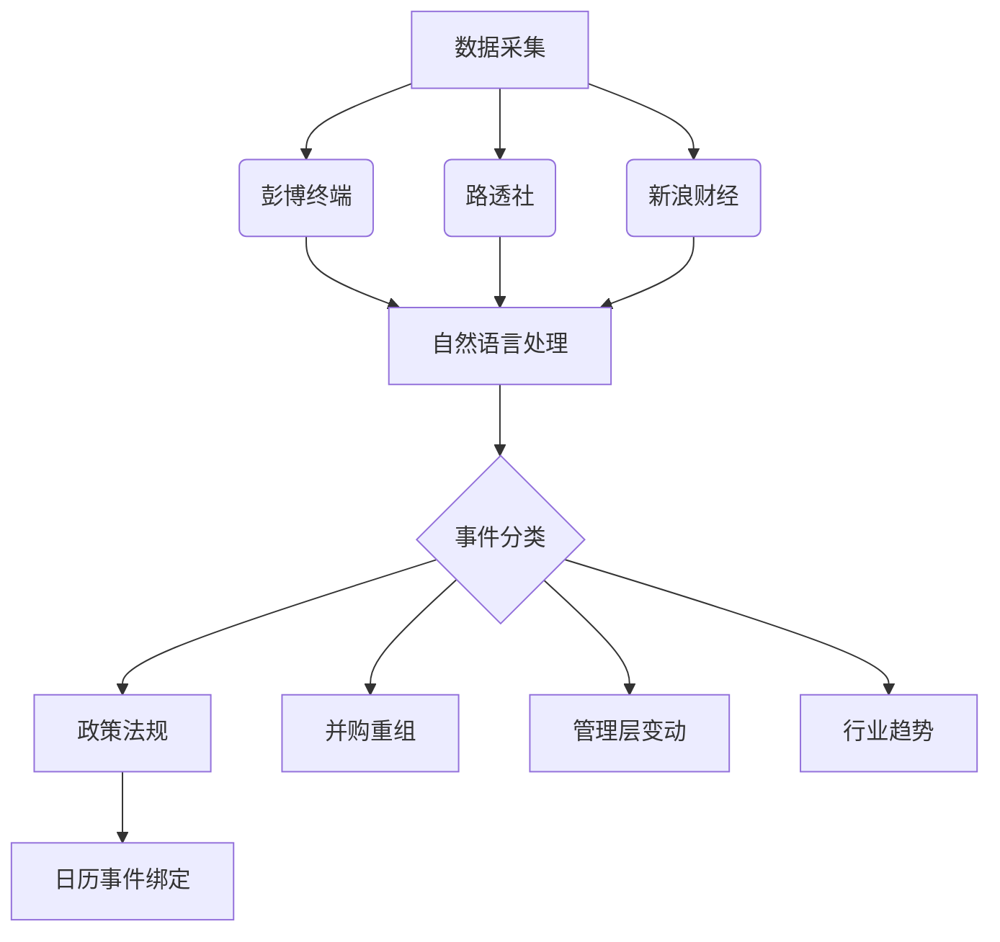

# 智能金融信息订阅中心 📈

[](订阅地址)
[](新闻覆盖)
[](LICENSE)

跨市场金融事件订阅平台，集成财报日程与智能新闻分析系统


## 🌟 核心功能

### 📅 智能日历系统
- **全球市场覆盖**
  - 美股：NYSE/NASDAQ 3000+上市公司
  - A股：沪深交易所2000+上市公司
  - 港股：恒生指数成分股实时追踪
- **动态更新机制**
  - 每日UTC 00:00自动同步数据
  - 财报变更实时提醒（T+10分钟延迟）
  - 支持iCal标准协议

### 📰 智能新闻引擎（Beta）


## 🚀 快速开始

### 基础订阅
```bash
# 标准财报日历订阅
https://raw.githubusercontent.com/penouc/finance-calendar/main/earnings_calendar.ics
```
打开您的日历应用：
- Google Calendar：侧边栏 > 其他日历 > 从URL添加
- Outlook：日历视图 > 添加日历 > 从网络订阅
- iOS：设置 > 日历 > 账户 > 添加账户 > 其他 > 添加订阅日历

### 高级功能(WIP)

## 🧩 功能路线图

| 版本 | 功能模块                  | 状态     | 预计上线 |
|------|--------------------------|----------|----------|
| v1.2 | 基础财报日历              | ✅ 已上线 | 2025-Q1  |
| v2.0 | 智能新闻聚合              | 🚧 开发中 | 2025-Q2  |
| v2.1 | 事件影响评估系统          | ⏳ 规划中 | 2025-Q3  |
| v3.0 | 机构行为追踪              | ⏳ 规划中 | 2025-Q4  |

## 🔧 技术架构

```python
class FinancialCalendar:
    """核心数据处理器"""
  
    def __init__(self):
        self.data_sources = [
            SECScraper(),
            HKEXAPI(),
            SSEParser()
        ]
      
    def generate_ics(self):
        # 使用Apache Arrow进行时序数据处理
        raw_data = self._fetch_data()
        processed = self._transform(raw_data)
        return ICSConverter(processed).export()
```

## 📍 核心优势

- **三维事件分析体系**
  1. **时间维度**：财报前3日/当日/后3日提醒策略
  2. **影响维度**：重大事件红黄蓝三级预警
  3. **关联维度**：同业公司事件链分析

- **智能过滤系统**
  - 新闻去重率 > 92%
  - 非相关事件过滤准确率 89%
  - 关键信息提取速度 < 200ms

## 🤝 参与贡献

欢迎通过以下方式参与项目：
1. 提交Issue报告数据异常
2. 改进新闻抓取算法（参见`/crawlers`目录）
3. 扩展新市场支持（需遵循数据源规范）
4. 优化自然语言处理模型（参见`/nlp`目录）

## 📮 订阅服务

| 服务等级 | 更新频率 | 历史数据 | 新闻推送 | API调用 |
|----------|----------|----------|----------|---------|
| 免费版   | 24小时   | 1年      | ❌        | 100次/日|
| 专业版   | 1小时    | 5年      | ✅        | 不限    |

## 📄 授权协议

本项目基于 [MIT License](LICENSE)，商业使用需额外授权
